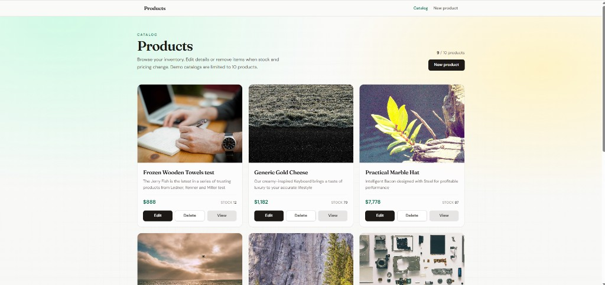

# Products CRUD — Full Stack (MERN + TypeScript)

A full-stack product catalog: REST API + React client, built end-to-end as a portfolio project.

The goal was not only to “finish a CRUD”, but to practice **real app structure**: validation, error handling, predictable React state, and UX around loading / confirm / success.

**Stack:** React 19 · TypeScript · Vite · Tailwind CSS · Express 5 · MongoDB · Mongoose · Zod

### Demo

[Watch the walkthrough on YouTube](https://youtu.be/fjAXo9T9ddE)



---

## Why this project

- Practice a complete **MERN** flow with TypeScript on both sides
- Separate API layers (routes → controllers → models → validation)
- Build a client with routing, custom hooks, forms, and modal confirmations
- Ship a UI that feels intentional (not only “it works”)

**Honest scope:** learning / portfolio project — run it locally. There is **no authentication**. Writes are capped at **10 products** to keep demos light on Atlas free-tier.

---

## Features

| Area | What you can do |
|------|------------------|
| Catalog | Responsive product grid with count `current / 10` |
| Create | Form with image URL preview; blocked at the 10-product limit |
| View | Product detail page + share link (copy to clipboard) |
| Edit | Prefill form, save with loading + success state |
| Delete | Confirmation modal (backdrop blur) + list refetch |
| API | Zod validation for create/update; clear error messages |
| Seed | Optional script to wipe & insert fake products for local demos |

---

## Architecture

```text
crud-products-fullstack/
├── client/     React + Vite + TypeScript (UI)
└── server/     Express + Mongoose + Zod (REST API)
```

```text
Browser (React)
    │  HTTP (JSON)
    ▼
Express API  ──► Zod validate ──► Controllers ──► Mongoose ──► MongoDB Atlas
```

| Layer | Responsibility |
|--------|----------------|
| `client` | Routes, pages, forms, hooks, UI states |
| `server` | HTTP API, validation, persistence |

---

## Tech stack

**Frontend:** React 19, TypeScript, Vite, React Router, Tailwind CSS v4, custom data hooks  

**Backend:** Node.js, Express 5 (ESM), TypeScript, Mongoose, Zod, dotenv, cors, Faker (seed only)

---

## API overview

Local base URL: `http://localhost:4000`

| Method | Endpoint | Description |
|--------|----------|-------------|
| `GET` | `/products` | List products |
| `GET` | `/products/:id` | Get one product |
| `POST` | `/products` | Create (rejected if catalog already has 10) |
| `PUT` | `/products/:id` | Update (partial body allowed; validated) |
| `DELETE` | `/products/:id` | Delete |

### Example document

```json
{
  "_id": "665f…",
  "name": "Trail Runner Pro",
  "description": "Lightweight daily trainer",
  "price": 12999,
  "stock": 12,
  "image": "https://…",
  "createdAt": "2026-07-18T19:35:34.460Z",
  "updatedAt": "2026-07-18T19:41:09.214Z"
}
```

---

## Getting started

### Prerequisites

- Node.js **20+**
- **pnpm** (recommended)
- A **MongoDB Atlas** cluster (M0 free is enough) or local MongoDB

### 1. Clone

```bash
git clone https://github.com/fdhammond/crud-products-fullstack.git
cd crud-products-fullstack
```

### 2. Backend

```bash
cd server
pnpm install
```

Create `server/.env` (never commit this file):

```env
PORT=4000
MONGODB_URI=mongodb+srv://<user>:<password>@<cluster>.mongodb.net/<dbname>?retryWrites=true&w=majority
```

```bash
pnpm dev
```

API: `http://localhost:4000`

#### Seed demo data (optional)

```bash
pnpm seed
```

This script:

1. Connects with `MONGODB_URI`
2. **`deleteMany` on the products collection** (wipes existing products)
3. Inserts fake products with Faker

Use it for local/demo DBs only — not against data you care about.

### 3. Frontend

```bash
cd client
pnpm install
```

Create `client/.env`:

```env
VITE_API_URL=http://localhost:4000
```

```bash
pnpm dev
```

App: `http://localhost:5173` (or the port Vite prints)

---

## Project structure

### Server

```text
server/src/
├── app.ts
├── config/db.ts
├── controllers/productsController.ts
├── middleware/validate.ts
├── models/Product.ts
├── routes/products.ts
├── schemas/productSchema.ts
└── scripts/seed.ts
```

### Client

```text
client/src/
├── App.tsx                 # React Router shell
├── constants.ts            # e.g. MAX_PRODUCTS = 10
├── components/             # Navbar, cards, delete modal, spinner
├── hooks/                  # useGetProducts (+ refetch), useGetProductById
├── pages/                  # List, create, edit, view
└── types/
```

---

## Design decisions (worth knowing)

- **Validation on the API (Zod)** — the client can be bypassed; the server enforces shape and the 10-product cap
- **One hook instance for the list** — after delete, the modal calls `refetchProducts` from the same hook that owns the list state (not a second hook instance)
- **Delete is a modal, not a route** — confirmation UX without leaving the catalog
- **TypeScript on both sides** — shared discipline; product `_id` typed to match MongoDB
- **No auth by design** — keeps the demo focused on CRUD fundamentals; production would add auth, stricter CORS, and rate limiting

---

## Scripts

### `server/`

| Command | Description |
|---------|-------------|
| `pnpm dev` | API with hot reload |
| `pnpm build` | Compile to `dist/` |
| `pnpm start` | Run compiled API |
| `pnpm seed` | Wipe products collection + insert fake data |

### `client/`

| Command | Description |
|---------|-------------|
| `pnpm dev` | Vite dev server |
| `pnpm build` | Production build |
| `pnpm preview` | Preview production build |

---

## Security & demo notes

| Topic | Approach in this repo |
|--------|------------------------|
| Secrets | `.env` gitignored — only `MONGODB_URI` / `VITE_API_URL` locally |
| Auth | None (demo). Do not store real user data |
| Write abuse | Max **10** products enforced in `POST /products` |
| Seed | Safe to commit (`seed.ts`). Dangerous to run on a non-demo DB (`deleteMany`) |
| CORS | Open for local development |
| Atlas | Network Access must allow your IP |

---

## Possible next steps

- Authentication (e.g. sessions/JWT) and per-user ownership  
- Stricter CORS + rate limiting on write routes  
- Shared form component for create/edit  

---

## License

ISC — personal / portfolio use.
